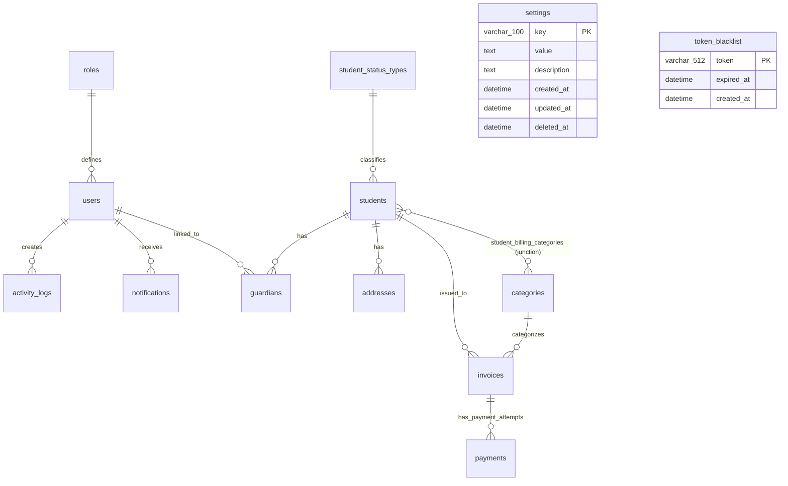

# Entity Relationship Diagram (ERD) - Al-Anwar Payment System

Dokumen ini berisi rancangan Entity Relationship Diagram (ERD) lengkap dan kamus data yang dianalisis langsung dari file Go Domain Model pada folder `backend_go/internal/model/domain/`.

---

## 1. Visualisasi ERD (Mermaid Diagram)

---

## 2. Kamus Data & Relasi Entitas

### A. Core Authentication & User Management

#### 1. `roles` (Model: `Role`)
Menyimpan data peran hak akses (e.g. `super_user`, `pengasuh`, `guardian`).
* **Relasi**: One-to-Many dengan `users` (RESTRICT on delete).

| Field | Tipe Data (MySQL) | Deskripsi & Constraints |
| :--- | :--- | :--- |
| `id` | `char(36)` | **Primary Key** (UUID) |
| `name` | `varchar(255)` | Nama Role (Unique, Indexed, Not Null) |
| `description` | `text` | Deskripsi peran |
| `created_at` | `datetime` | Waktu dibuat |
| `updated_at` | `datetime` | Waktu terakhir di-update |
| `deleted_at` | `datetime` | Soft delete timestamp (Indexed) |

#### 2. `users` (Model: `User`)
Menyimpan kredensial login dan data profil dasar dari semua administrator, pengasuh, maupun wali santri.
* **Relasi**: Many-to-One dengan `roles`, One-to-Many dengan `activity_logs`, `notifications`, dan `guardians`.

| Field | Tipe Data (MySQL) | Deskripsi & Constraints |
| :--- | :--- | :--- |
| `id` | `char(36)` | **Primary Key** (UUID) |
| `username` | `varchar(50)` | Nama pengguna unik (Unique, Indexed, Not Null) |
| `password` | `varchar(255)` | Hash sandi (Not Null) |
| `is_active` | `tinyint(1)` / `bool` | Status keaktifan akun |
| `role_id` | `char(36)` | **Foreign Key** ke `roles(id)` (Not Null, Indexed) |
| `first_name` | `varchar(100)` | Nama depan (Not Null) |
| `middle_name`| `varchar(100)` | Nama tengah (Optional) |
| `last_name`  | `varchar(100)` | Nama belakang (Optional) |
| `email` | `varchar(100)` | Alamat email |
| `phone_number` | `varchar(20)` | Nomor telepon |
| `gender` | `char(1)` | Jenis kelamin (`L` / `P`, default `L`) |
| `birth_date` | `datetime` | Tanggal lahir |
| `address` | `text` | Alamat fisik tinggal |
| `last_login_at` | `datetime` | Log login terakhir |
| `created_at` | `datetime` | Waktu dibuat |
| `updated_at` | `datetime` | Waktu terakhir di-update |
| `deleted_at` | `datetime` | Soft delete timestamp (Indexed) |

---

### B. Core Student & Parent Directory

#### 3. `students` (Model: `Student`)
Entitas utama untuk data santri.
* **Relasi**: 
  * Many-to-One dengan `student_status_types`.
  * One-to-Many dengan `guardians`, `addresses`, dan `invoices`.
  * Many-to-Many dengan `categories` melalui tabel persimpangan `student_billing_categories`.

| Field | Tipe Data (MySQL) | Deskripsi & Constraints |
| :--- | :--- | :--- |
| `id` | `char(36)` | **Primary Key** (UUID) |
| `first_name` | `varchar(255)` | Embedded field dari `Name` |
| `middle_name`| `varchar(255)` | Embedded field dari `Name` |
| `last_name`  | `varchar(255)` | Embedded field dari `Name` |
| `nik` | `varchar(255)` | Nomor Induk Kependudukan (Indexed) |
| `birth_date` | `varchar(255)` | Tanggal lahir santri |
| `student_number` | `varchar(255)` | NIS (Unique, Not Null, Indexed) |
| `gender` | `varchar(255)` | Jenis kelamin |
| `is_active` | `tinyint(1)` / `bool` | Status keaktifan santri (Indexed) |
| `muhadhoroh_level` | `tinyint` | Level kelas muhadhoroh (default `1`, Indexed) |
| `current_semester` | `tinyint` | Semester saat ini (default `1`) |
| `status_id` | `char(36)` | **Foreign Key** ke `student_status_types(id)` (Not Null, RESTRICT on delete, Indexed) |
| `created_at` | `datetime` | Waktu dibuat |
| `updated_at` | `datetime` | Waktu terakhir di-update |
| `deleted_at` | `datetime` | Soft delete timestamp (Indexed) |

#### 4. `student_status_types` (Model: `StudentStatusType`)
Pengelompokan status santri yang berdampak langsung pada pemotongan/diskon biaya tagihan bulanan (contoh: Beasiswa, Yatim, Regular).
* **Relasi**: One-to-Many dengan `students` (RESTRICT on delete).

| Field | Tipe Data (MySQL) | Deskripsi & Constraints |
| :--- | :--- | :--- |
| `id` | `char(36)` | **Primary Key** (UUID) |
| `name` | `varchar(50)` | Nama status (Unique, Not Null, Indexed) |
| `discount_percentage` | `decimal(5,2)` | Persentase diskon tagihan bulanan (default `0.00`) |
| `is_active_billing` | `tinyint(1)` / `bool` | Apakah penagihan aktif untuk status ini (Indexed) |
| `is_default` | `tinyint(1)` / `bool` | Default status saat registrasi santri baru |
| `description` | `text` | Keterangan status |
| `created_at` | `datetime` | Waktu dibuat |
| `updated_at` | `datetime` | Waktu terakhir di-update |
| `deleted_at` | `datetime` | Soft delete timestamp (Indexed) |

#### 5. `guardians` (Model: `Guardian`)
Wali atau Orang Tua santri. Menghubungkan wali ke data login user dan data santri.
* **Relasi**: Many-to-One dengan `students` (CASCADE on delete) dan `users` (CASCADE on delete).

| Field | Tipe Data (MySQL) | Deskripsi & Constraints |
| :--- | :--- | :--- |
| `id` | `char(36)` | **Primary Key** (UUID) |
| `student_id` | `char(36)` | **Foreign Key** ke `students(id)` (Not Null, Indexed) |
| `user_id` | `char(36)` | **Foreign Key** ke `users(id)` (Not Null, Indexed) |
| `first_name` | `varchar(255)` | Embedded field dari `Name` |
| `middle_name`| `varchar(255)` | Embedded field dari `Name` |
| `last_name`  | `varchar(255)` | Embedded field dari `Name` |
| `phone` | `varchar(255)` | Nomor telepon wali |
| `email` | `varchar(255)` | Email wali |
| `relation` | `varchar(50)` | Hubungan dengan santri (e.g. Ayah, Ibu, Paman) |
| `created_at` | `datetime` | Waktu dibuat |
| `updated_at` | `datetime` | Waktu terakhir di-update |
| `deleted_at` | `datetime` | Soft delete timestamp (Indexed) |

#### 6. `addresses` (Model: `Address`)
Menyimpan riwayat alamat tempat tinggal santri.
* **Relasi**: Many-to-One dengan `students` (CASCADE on delete).

| Field | Tipe Data (MySQL) | Deskripsi & Constraints |
| :--- | :--- | :--- |
| `id` | `char(36)` | **Primary Key** (UUID) |
| `student_id` | `char(36)` | **Foreign Key** ke `students(id)` (Not Null, Indexed) |
| `address_line` | `text` | Alamat jalan / RT / RW (Not Null) |
| `village` | `varchar(100)` | Kelurahan / Desa |
| `district` | `varchar(100)` | Kecamatan |
| `city` | `varchar(100)` | Kota / Kabupaten |
| `province` | `varchar(100)` | Provinsi |
| `country` | `varchar(100)` | Negara (default `'Indonesia'`) |
| `postal_code` | `varchar(10)` | Kode Pos |
| `is_primary` | `tinyint(1)` / `bool` | Penanda alamat utama (Indexed) |
| `created_at` | `datetime` | Waktu dibuat |
| `updated_at` | `datetime` | Waktu terakhir di-update |
| `deleted_at` | `datetime` | Soft delete timestamp (Indexed) |

---

### C. Billing & Invoices Management

#### 7. `categories` (Model: `Category`)
Kategori pos biaya penagihan (e.g., SPP bulanan, Uang Ujian Semester, Gedung).
* **Relasi**: 
  * Many-to-Many dengan `students` (lewat junction table).
  * One-to-Many dengan `invoices` (RESTRICT on delete).

| Field | Tipe Data (MySQL) | Deskripsi & Constraints |
| :--- | :--- | :--- |
| `id` | `char(36)` | **Primary Key** (UUID) |
| `name` | `varchar(50)` | Nama kategori (Unique, Not Null, Indexed) |
| `base_amount` | `decimal(15,2)` | Tarif dasar tagihan |
| `is_fixed` | `tinyint(1)` / `bool` | Apakah tarif tetap (Indexed) |
| `is_active` | `tinyint(1)` / `bool` | Kategori aktif digunakan (Indexed) |
| `is_semester` | `tinyint(1)` / `bool` | Biaya per semester (default `false`, Indexed) |
| `description` | `text` | Penjelasan detail |
| `created_at` | `datetime` | Waktu dibuat |
| `updated_at` | `datetime` | Waktu terakhir di-update |
| `deleted_at` | `datetime` | Soft delete timestamp (Indexed) |

#### 8. `student_billing_categories` (Junction Table GORM)
Tabel persimpangan Many-to-Many yang menghubungkan jenis tagihan wajib yang dialokasikan khusus pada tiap santri.

| Field | Tipe Data (MySQL) | Deskripsi & Constraints |
| :--- | :--- | :--- |
| `student_id` | `char(36)` | **Foreign/Primary Key** ke `students(id)` (CASCADE on delete) |
| `category_id`| `char(36)` | **Foreign/Primary Key** ke `categories(id)` (CASCADE on delete) |

#### 9. `invoices` (Model: `Invoice`)
Dokumen tagihan yang ditujukan kepada santri berdasarkan kategori tertentu.
* **Relasi**: Many-to-One dengan `students` (CASCADE on delete), Many-to-One dengan `categories` (RESTRICT on delete), dan One-to-Many dengan `payments` (CASCADE on delete).

| Field | Tipe Data (MySQL) | Deskripsi & Constraints |
| :--- | :--- | :--- |
| `id` | `char(36)` | **Primary Key** (UUID) |
| `student_id` | `char(36)` | **Foreign Key** ke `students(id)` (Not Null, Indexed) |
| `category_id`| `char(36)` | **Foreign Key** ke `categories(id)` (Not Null, Indexed) |
| `invoice_number` | `varchar(80)` | Nomor invoice unik (Unique, Not Null, Indexed) |
| `month` | `tinyint` | Bulan Masehi tagihan (Not Null) |
| `year` | `smallint` | Tahun Masehi tagihan (Not Null) |
| `hijri_month` | `tinyint` | Bulan Hijriah (default `0`, Indexed) |
| `hijri_year` | `smallint` | Tahun Hijriah (default `0`, Indexed) |
| `semester` | `tinyint` | Semester akademik (default `0`, Indexed) |
| `academic_year_label` | `varchar(30)` | Label tahun ajaran (e.g., "1447/1448 H") |
| `amount_due` | `decimal(15,2)` | Total nominal tagihan (setelah dikurangi diskon status) |
| `status` | `enum` | `'unpaid'`, `'pending'`, `'paid'`, `'expired'`, `'cancelled'` (Indexed) |
| `due_date` | `datetime` | Batas akhir pembayaran |
| `notified_at` | `datetime` | Kapan terakhir notifikasi tagihan dikirim |
| `created_at` | `datetime` | Waktu dibuat |
| `updated_at` | `datetime` | Waktu terakhir di-update |
| `deleted_at` | `datetime` | Soft delete timestamp (Indexed) |

#### 10. `payments` (Model: `Payment`)
Transaksi pembayaran (baik online via Midtrans maupun bukti transfer manual).
* **Relasi**: Many-to-One dengan `invoices` (CASCADE on delete).

| Field | Tipe Data (MySQL) | Deskripsi & Constraints |
| :--- | :--- | :--- |
| `id` | `char(36)` | **Primary Key** (UUID) |
| `invoice_id` | `char(36)` | **Foreign Key** ke `invoices(id)` (Not Null, Indexed) |
| `attempt_number` | `int` | Urutan percobaan pembayaran (default `1`) |
| `external_id` | `varchar(100)` | Order ID eksternal (e.g. Midtrans Order ID, Indexed) |
| `snap_token` | `varchar(255)` | Token pembayaran Midtrans Snap |
| `amount_paid` | `decimal(15,2)` | Jumlah yang dibayarkan |
| `payment_method` | `varchar(50)` | Bank Transfer, GoPay, Qris, dll |
| `transaction_status` | `varchar(50)` | Status transaksi dari payment gateway (Indexed) |
| `payment_date` | `datetime` | Tanggal sukses bayar |
| `raw_response` | `json` | Callback JSON lengkap dari Midtrans |
| `evidence_url` | `varchar(255)` | Link gambar bukti transfer (untuk manual) |
| `notes` | `text` | Catatan manual bendahara |
| `created_at` | `datetime` | Waktu dibuat |
| `updated_at` | `datetime` | Waktu terakhir di-update |
| `deleted_at` | `datetime` | Soft delete timestamp (Indexed) |

---

### D. System & Logs

#### 11. `notifications` (Model: `Notification`)
Notifikasi sistem ke user (terutama wali santri).
* **Relasi**: Many-to-One dengan `users` (CASCADE on delete).

| Field | Tipe Data (MySQL) | Deskripsi & Constraints |
| :--- | :--- | :--- |
| `id` | `char(36)` | **Primary Key** (UUID) |
| `user_id` | `char(36)` | **Foreign Key** ke `users(id)` (Not Null, Indexed) |
| `title` | `varchar(150)` | Judul notifikasi (Not Null) |
| `message` | `text` | Isi pesan (Not Null) |
| `type` | `varchar(50)` | Kategori notifikasi (Indexed) |
| `is_read` | `tinyint(1)` / `bool` | Status dibaca (default `false`, Indexed) |
| `read_at` | `datetime` | Waktu dibaca |
| `created_at` | `datetime` | Waktu dibuat |
| `deleted_at` | `datetime` | Soft delete timestamp (Indexed) |

#### 12. `activity_logs` (Model: `ActivityLog`)
Log audit trail untuk mencatat aktivitas penting (e.g. tambah santri, approve invoice, ubah kategori).
* **Relasi**: Many-to-One dengan `users` (CASCADE on delete).

| Field | Tipe Data (MySQL) | Deskripsi & Constraints |
| :--- | :--- | :--- |
| `id` | `char(36)` | **Primary Key** (UUID) |
| `user_id` | `char(36)` | **Foreign Key** ke `users(id)` (Not Null, Indexed) |
| `action` | `varchar(255)` | Aksi yang dilakukan (Not Null, Indexed) |
| `entity_name`| `varchar(50)`  | Nama tabel entitas terdampak (Indexed) |
| `entity_id`  | `char(36)`      | ID dari entitas terdampak (Indexed) |
| `payload` | `json` | Payload data sebelum/sesudah aksi |
| `ip_address` | `varchar(45)` | IP Address operator |
| `user_agent` | `text` | Browser/Client Agent operator |
| `created_at` | `datetime` | Waktu log dicatat (Indexed) |

#### 13. `settings` (Model: `Setting`)
Pengaturan global sistem (e.g., nama instansi, tarif default, konfigurasi Midtrans).
* **Relasi**: Berdiri Sendiri.

| Field | Tipe Data (MySQL) | Deskripsi & Constraints |
| :--- | :--- | :--- |
| `key` | `varchar(100)` | **Primary Key** (Identifier Unik) |
| `value` | `text` | Nilai konfigurasi |
| `description` | `text` | Penjelasan kegunaan setting |
| `created_at` | `datetime` | Waktu dibuat |
| `updated_at` | `datetime` | Waktu terakhir di-update |
| `deleted_at` | `datetime` | Soft delete timestamp (Indexed) |

#### 14. `token_blacklist` (Model: `TokenBlacklist`)
Menyimpan token JWT yang sudah di-logout/dibatalkan sebelum masa kedaluwarsanya habis.
* **Relasi**: Berdiri Sendiri.

| Field | Tipe Data (MySQL) | Deskripsi & Constraints |
| :--- | :--- | :--- |
| `token` | `varchar(512)` | **Primary Key** (Token String, Indexed) |
| `expired_at` | `datetime` | Batas kedaluwarsa token (Indexed, Not Null) |
| `created_at` | `datetime` | Waktu token masuk daftar hitam |

---

## 3. Fitur Utama Arsitektur Basis Data
1. **UUID (Universally Unique Identifier)**: Semua ID tabel utama menggunakan UUID `char(36)` yang digenerate di sisi aplikasi, mencegah kebocoran informasi volume transaksi (insecure direct object references) dibanding auto-increment.
2. **Soft Deletes**: Menggunakan mekanisme GORM `gorm.DeletedAt` (kolom `deleted_at` terindeks) untuk menjaga integritas data riwayat keuangan pesantren jika ada santri/wali yang dihapus secara tidak sengaja.
3. **Auditing Terintegrasi**: Perubahan data sensitif secara otomatis direkam melalui model `ActivityLog` dengan informasi operator, payload JSON asli, IP, dan User Agent.
